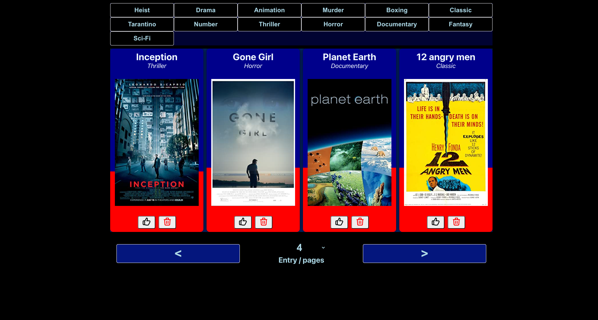

# Interview TakeHome Project

Mini project done for an interview

Made with React / Redux and the help of [The Open Movie Database API](https://www.omdbapi.com/)

In the absence of a specific graphic design, a brutalist functional css style was adopted

# Screenshot

In the project directory, you can run:

## `npm start`

Runs the app in the development mode.\
Open [http://localhost:3000](http://localhost:3000) to view it in your browser.

The page will reload when you make changes.\
You may also see any lint errors in the console.
